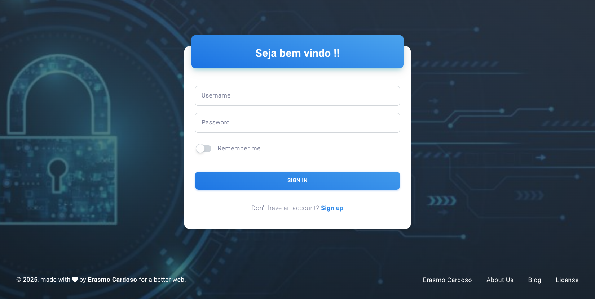
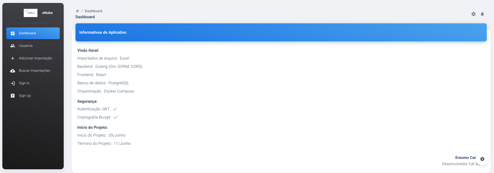
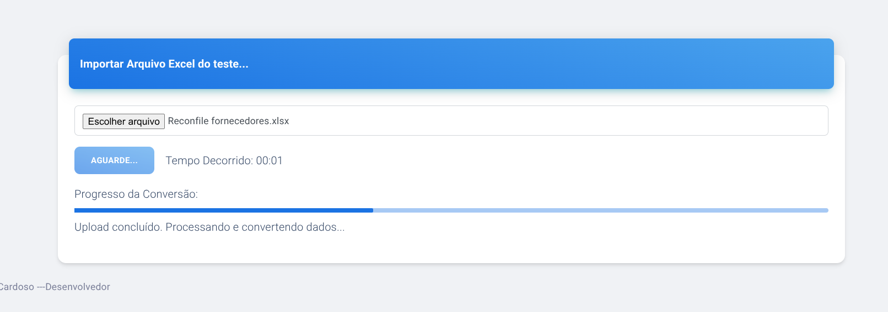
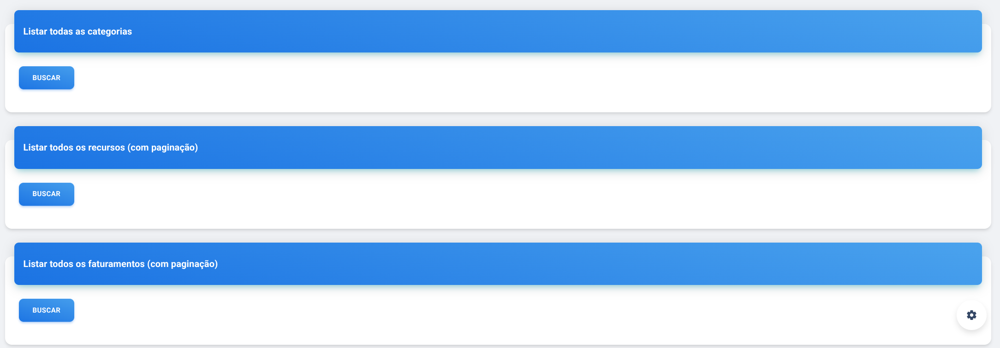

# Enube - Projeto de Teste

## Descrição
Projeto de teste para enube (importação e análise de dados arquivo excel). Uma aplicação moderna e robusta para gerenciamento e análise de dados de faturamento.

## Tecnologias
### Backend
- Go (Gin, GORM)
- PostgreSQL
- Docker

### Frontend
- React 18
- Material-UI (MUI)
- Material Dashboard 2 React
- React Router DOM
- Axios
- JWT Authentication
- React Icons
- Chart.js
- React Dropzone

## Requisitos
- Docker
- Docker Compose

## Instalação

1. Clone o repositório:
```bash
git clone https://github.com/erascardsilva/enube_projeto.git
cd enube_projeto
```

2. Inicie os containers:
```bash
docker-compose build
docker-compose up -d
```

3. Acesse a aplicação:
```
Frontend: http://localhost:3000
Backend: http://localhost:8080
```

## Frontend - Funcionalidades

### Autenticação
- **Login**: Interface moderna com validação de campos e feedback visual
- **Registro**: Formulário de cadastro com validação em tempo real
- **Proteção de Rotas**: Sistema de autenticação JWT com redirecionamento automático

### Dashboard
- **Visão Geral**: Cards informativos com estatísticas do sistema
- **Resumo do Projeto**: Informações sobre tecnologias utilizadas e timeline
- **Interface Responsiva**: Adaptação perfeita para diferentes tamanhos de tela

### Importação de Dados
- **Upload de Excel**: Interface drag-and-drop para arquivos
- **Validação de Arquivos**: Verificação de formato e estrutura
- **Feedback Visual**: Progresso de upload e status de processamento

### Busca e Visualização
- **Categorias**: Listagem paginada com filtros
- **Recursos**: Visualização detalhada com paginação
- **Faturamentos**: Tabela interativa com ordenação
- **Resumos**:
  - Por Categorias
  - Por Recursos
  - Por Clientes
  - Por Meses

### Interface
- **Design Moderno**: Baseado no Material Design
- **Temas**: Suporte a tema claro/escuro
- **Componentes**: Cards, Tabelas, Gráficos e Formulários personalizados
- **Navegação**: Menu lateral responsivo
- **Feedback**: Alertas e notificações contextuais

## Estrutura do Projeto
```
.
├── backend/
│   ├── cmd/
│   ├── internal/
│   │   ├── auth/
│   │   ├── handlers/
│   │   ├── importer/
│   │   ├── middleware/
│   │   ├── models/
│   │   ├── repository/
│   │   ├── routes/
│   │   └── service/
│   ├── init.sql
│   └── Dockerfile
├── frontend/
│   ├── src/
│   │   ├── assets/
│   │   ├── components/
│   │   ├── contexts/
│   │   ├── layouts/
│   │   ├── pages/
│   │   ├── api/
│   │   └── utils/
│   └── Dockerfile
├── docker-compose.yml
└── README.md
```

## Desenvolvimento

### Backend
```bash
cd backend
go mod tidy
go run main.go
```

### Frontend
```bash
cd frontend
npm install
npm start
```

## Screenshots

### Login


### Dashboard


### Importação


### Busca


## Uso

1. **Acesso ao Sistema**
   - Acesse http://localhost:3000
   - Faça login com suas credenciais ou crie uma nova conta

2. **Importação de Dados**
   - Navegue até a seção "Importar"
   - Busque seu arquivo Excel ou clique para selecionar ( importante ser Reconfile fornecedores.xlsx que se encontra na pasta Base na raiz do projeto  )
   - Aguarde o processamento

3. **Análise de Dados**
   - Utilize o dashboard para visão geral
   - Explore os diferentes resumos disponíveis
   - Filtre e pesquise dados específicos

4. **Gerenciamento**
   - Visualize categorias, recursos e faturamentos
   - Utilize a paginação para navegar entre grandes conjuntos de dados
   - Exporte relatórios quando necessário


Desenvolvido por Erasmo Cardoso da Silva ( whats 11949224355 )